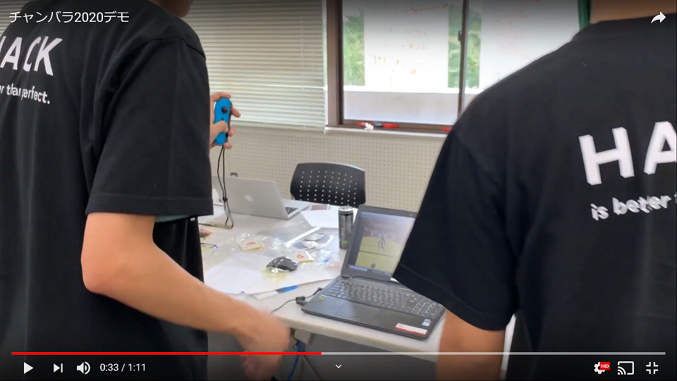

# チャンバラ２０２０

## 
### チャンバラ X Tech

### 背景（製品開発のきっかけ、課題等）
unityを使っていままでにないミライの遊びを考えた中で
いくつかの案の中、Joyconのセンサーを使い
運動（チャンバラごっこ）をするという最先端の遊びを考えた。

### 製品説明（具体的な製品の説明）
２人で対戦する対人ゲーム
Joyconでプレイヤーを操作する。

＜ルール＞
ゲーム内のキャラクターにはターゲットがあり
２人とも刀を持っています。
ターゲットに刀を当てたら勝ち（１本）になる。

---> １分ｘ３セット（２本先取）

### 特長
Joyconのセンサーを使うので、操作が楽
ルールがシンプル

### 解決出来ること
Joyconをつかい、日常的にはできないであろうチャンバラごっこを
安全に室内等で体験できるゲーム。

### 今後の展望
キャラクタ選択やアニメーションの追加といったクオリティの向上

## 開発内容・開発技術

### 活用した技術

#### API・データ
今回スポンサーから提供されたAPI、製品などの外部技術があれば記述をして下さい。

* ミライ小町３Dモデル（バンダイナムコさん公式）
* 
* 

#### フレームワーク・ライブラリ・モジュール
* JoyconLib Copyright (c) 2017 Looking Glass  https://github.com/Looking-Glass/JoyconLib
* Unity

#### デバイス
* スイッチのジョイコン
* 

### 研究内容・事前開発プロダクト（任意）
ご自身やチームの研究内容や、事前に持ち込みをしたプロダクトがある場合は、こちらに実績なども含め記載をして下さい。

* 
* 

### 独自開発技術（Hack Dayで開発したもの）
#### 2日間に開発した独自の機能・技術
* 独自で開発したものの内容をこちらに記載してください
* 特に力を入れた部分をファイルリンク、またはcommit_idを記載してください（任意）
